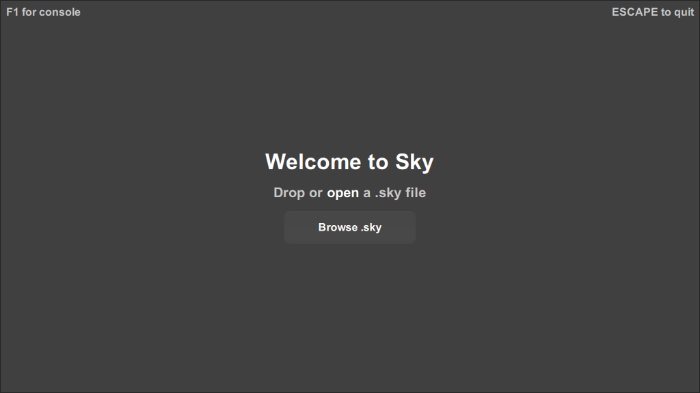

---

Sky runtime is a high performance, script-driven aplication runtime. It's designed to run QML based
.sky scripts in tandem with [Sky kit](https://omega.gg/Sky/sources) C++ API(s) and Qt UI components.
It enables versatile use cases and rapid iterations while keeping things simple and minimalistic.
  
Sky runtime is a good candidate for LLM-driven code generation, with agility that fits the modern
landscape. This runtime favors a client based approach that relies on local computing resources.
It promotes lightweight sources .skz packages distribution instead of binaries.

- [Bash scripts](bash/README.md)

## Extensions

- [hypergonar](https://omega.gg/hypergonar/sources) - Frame compositor for generative software
- [turbopixel](https://omega.gg/turbopixel/sources) - Efficient local image generator

## Usage

    sky <script> [options]

    Where <script> is a .sky script or a .skz archive you want to run.

## Options

    --help    Print the help
    --cli     Run the script headless

## Technology

sky is built in C++ with [Sky kit](https://omega.gg/Sky/sources). 

## Platforms

- Windows 32 bit / 64 bit.
- macOS 64 bit.
- Linux 32 bit / 64 bit.
- iOS 64 bit.
- Android 32 bit / 64 bit.

## Requirements

- [Sky](https://omega.gg/Sky/sources) latest version.
- [Qt](https://download.qt.io/official_releases/qt) 6.10.0 or later.

On Windows:
- [MinGW](https://sourceforge.net/projects/mingw) or [Git for Windows](https://git-for-windows.github.io).

## 3rdparty

You can install third party libraries with:

    sh 3rdparty.sh <win32 | win64 | macOS | iOS | linux | android> [all]

## Configure

You can configure sky with:

    sh configure.sh <win32 | win64 | macOS | iOS | linux | android> [sky | clean]

## Build

You can build sky with:

    sh build.sh <win32 | win64 | macOS | iOS | linux | android> [all | deploy | clean]

## Deploy

You can deploy sky with:

    sh deploy.sh <win32 | win64 | macOS | iOS | linux | android> [clean]

## License

Copyright (C) 2015 - 2024 Sky kit runtime authors | https://omega.gg/Sky

### Authors

- Benjamin Arnaud aka [bunjee](https://bunjee.me) | <bunjee@omega.gg>

### GNU General Public License Usage

sky may be used under the terms of the GNU General Public License version 3 as published by the
Free Software Foundation and appearing in the LICENSE.md file included in the packaging of this
file. Please review the following information to ensure the GNU General Public License requirements
will be met: https://www.gnu.org/licenses/gpl.html.

### Private License Usage

sky licensees holding valid private licenses may use this file in accordance with the private
license agreement provided with the Software or, alternatively, in accordance with the terms
contained in written agreement between you and sky authors. For further information contact us at
contact@omega.gg.
